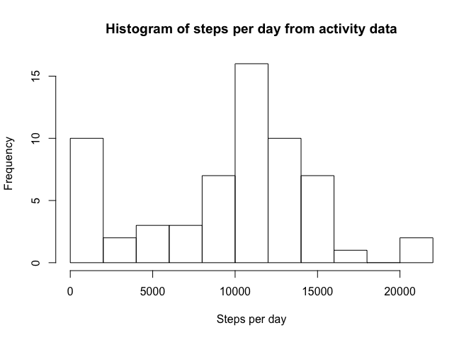
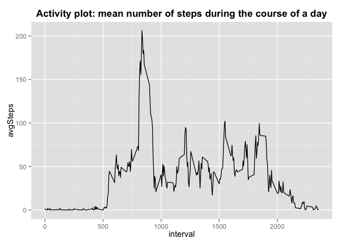
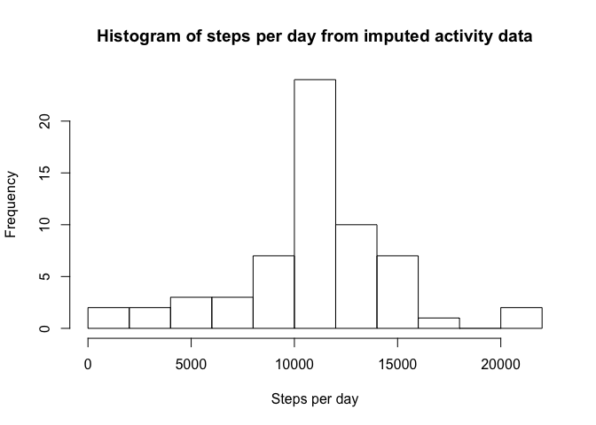
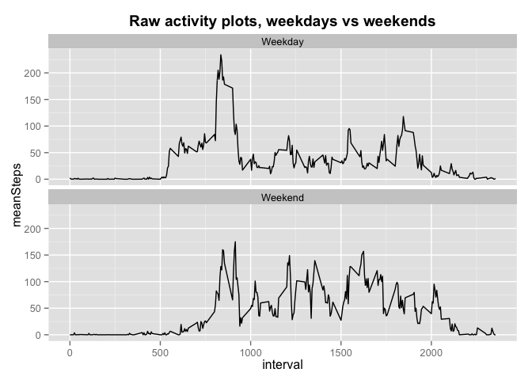

# Reproducible Research, Assignment 1
Roby Bhattacharyya  
May 14, 2015  


Reproducible Research, Assignment 1
===================================
Roby  
14 May 2015


## Assignment  
Thanks for reading! This is my first time trying RMarkdown.  
For this assignment, we are trying to display activity patterns from data generated by personal monitoring equipment. This document should walk us through the steps required for these simple analyses.  

### A. Loading and pre-processing data  
First a quick check - before executing this code, be sure the **correct working directory** is selected - specifically, the present working directory must contain the data file entitled *"activity.csv"*. The following code should check that:


```r
getwd()
```

```
## [1] "/Users/robysf/Documents/Fellowship/Coursera/Reproducible_Research/RepData_PeerAssessment1"
```

```r
list.files()
```

```
##  [1] "activity.csv"         "activity.zip"         "doc"                 
##  [4] "instructions_fig"     "old_PA1_template.Rmd" "PA1_template_files"  
##  [7] "PA1_template.html"    "PA1_template.md"      "PA1_template.Rmd"    
## [10] "README.md"
```

```r
ifelse(file.exists("activity.csv"), print("Looks good!"), print("Hmmm...can't find activity.csv"))
```

```
## [1] "Looks good!"
```

```
## [1] "Looks good!"
```

If it couldn't find the file, try changing the working directory. If it said "Looks good!", then we're ready to proceed. (I'm not sure why it says "Looks good!" twice...)  

Now that we're in the right place, let's load two packages that I will use:  
 - **dplyr** for data manipulation  
 - **ggplot2** for plotting
 

```r
if(!require("dplyr")) install.packages("dplyr")
```

```
## Loading required package: dplyr
## 
## Attaching package: 'dplyr'
## 
## The following object is masked from 'package:stats':
## 
##     filter
## 
## The following objects are masked from 'package:base':
## 
##     intersect, setdiff, setequal, union
```

```r
library(dplyr)
if(!require("ggplot2")) install.packages("ggplot2")
```

```
## Loading required package: ggplot2
```

```r
library(ggplot2)
```

#### 1. Load data and 2. Process/transform data:  

The following code reads the data file into a data.frame, and then converts the date column from characters to dates.  


```r
actData <- read.csv(file = "activity.csv", header = TRUE, stringsAsFactors = FALSE)
actData$date <- as.Date(actData$date)
```

### B. Determine steps per day  

#### 1. Calculate total number of steps per day  

I use the **dplyr** package to first group data by day, then summarize by average number of steps per day (removing all NA values).  


```r
actData_byDay <- group_by(actData, date)
actData_byDay_sumSteps <- summarize(actData_byDay, stepsPerDay = sum(steps, na.rm = TRUE))
```

#### 2. Plot histogram of steps per day  

Using the qplot() feature of **ggplot2**  


```r
hist(actData_byDay_sumSteps$stepsPerDay, breaks = 10, 
     main = "Histogram of steps per day from activity data", xlab = "Steps per day")
```

 

#### 3. Calculate and report mean number of steps per day  

This code should be fairly straightforward.  


```r
medianSteps <- median(actData_byDay_sumSteps$stepsPerDay)
meanSteps <- mean(actData_byDay_sumSteps$stepsPerDay)
print(paste("The median number of steps per day is:", medianSteps))
```

```
## [1] "The median number of steps per day is: 10395"
```

```r
print(paste("The mean number of steps per day is:", meanSteps))
```

```
## [1] "The mean number of steps per day is: 9354.22950819672"
```


### C. Average daily activity pattern  

#### 1. Time series plot  

The goal here is to make a plot with each 5-minute interval across a day on the x-axis, and the number of steps taken in that interval (averaged across all days) on the y-axis. I'll use **dplyr** to group by interval, then calculate the mean number of steps during each interval (across all days), and finally plot the resulting data.  


```r
actData_byInterval <- group_by(actData, interval)
actData_byInterval_avgSteps <- summarize(actData_byInterval, 
                                         avgSteps = mean(steps, na.rm = TRUE))
qplot(x = interval, y = avgSteps, data = actData_byInterval_avgSteps, geom = "line", 
      main = "Activity plot: mean number of steps during the course of a day") + 
        theme(plot.title = element_text(face = "bold", vjust = 1))
```

 

#### 2. Which time interval contains the most steps?

I use which.max() to identify the index of the most common, and then use that to slice/subset the grouped, summarized dataset to identify the value of that interval.


```r
maxInterval <- actData_byInterval_avgSteps$interval[which.max(actData_byInterval_avgSteps$avgSteps)]
print(paste("the interval with the most steps is:", maxInterval))
```

```
## [1] "the interval with the most steps is: 835"
```

So, it looks like there's a fairly uniform morning commute time that causes a spike?

### D. Impute missing values  

Now, rather than removing NA's, I'll replace them with best-estimates  

#### 1. Calculate and report number of missing values in dataset  

Just using sum(is.na())


```r
totalNAsteps <- sum(is.na(actData$steps))
print(paste("The total number of NAs in the dataset is:", totalNAsteps))
```

```
## [1] "The total number of NAs in the dataset is: 2304"
```

#### 2. Devise strategy to fill in these missing values  

For each missing value at a given time interval, I opted to just fill in the average value for that same time interval from all other days for which it was measured.  

#### 3. Create a new dataset with missing values filled in  

For this, I'll first copy the original data.frame, then use replace() to identify locations where NA values are found, and substitute the average number of steps for that time interval (calculated from the na.rm data.frame above).


```r
actDataImputed <- actData
actDataImputed$steps <- replace(actDataImputed$steps, is.na(actDataImputed$steps),
                         actData_byInterval_avgSteps$avgSteps)
```

This new data.frame, actDataImputed, now has replaced the original "steps" variable with a version in which all NAs are replaced by average values. We can see that it has worked by displaying the first 6 rows of the Imputed dataset compared to the original:  


```r
head(actData)
```

```
##   steps       date interval
## 1    NA 2012-10-01        0
## 2    NA 2012-10-01        5
## 3    NA 2012-10-01       10
## 4    NA 2012-10-01       15
## 5    NA 2012-10-01       20
## 6    NA 2012-10-01       25
```

```r
head(actDataImputed)
```

```
##       steps       date interval
## 1 1.7169811 2012-10-01        0
## 2 0.3396226 2012-10-01        5
## 3 0.1320755 2012-10-01       10
## 4 0.1509434 2012-10-01       15
## 5 0.0754717 2012-10-01       20
## 6 2.0943396 2012-10-01       25
```

#### 4a. Plot histogram of total steps per day from imputed data

Code is similar to that for generating the histogram above for raw data with NA's removed.  


```r
actDataImputed_byDay <- group_by(actDataImputed, date)
actDataImputed_byDay_sumSteps <- summarize(actDataImputed_byDay, stepsPerDay = sum(steps))
hist(actDataImputed_byDay_sumSteps$stepsPerDay, breaks = 10, 
     main = "Histogram of steps per day from imputed activity data", xlab = "Steps per day")
```

 

#### 4b. Calculate and report mean and median number of steps from imputed data  

Code is similar to the above for raw data with NA's removed.  


```r
medianStepsImputed <- median(actDataImputed_byDay_sumSteps$stepsPerDay)
meanStepsImputed <- mean(actDataImputed_byDay_sumSteps$stepsPerDay)
print(paste("The median number of steps per day from imputed data is:", medianStepsImputed))
```

```
## [1] "The median number of steps per day from imputed data is: 10766.1886792453"
```

```r
print(paste("The mean number of steps per day from imputed data is:", meanStepsImputed))
```

```
## [1] "The mean number of steps per day from imputed data is: 10766.1886792453"
```

Note that in the imputed data, the mean and median are *exactly the same!*. This is because my method of imputing missing values replaced the missing values with the average missing values for that time interval. This changed the histogram, but NOT the average at each interval. Since the histogram changed (essentially removing days on which there were no steps recorded - simply because the device was not worn), the relationship between the median and mean changed. And in particular, since several days had no measurements at all and were thus replaced with the average (mean), these were positioned at the median and thus the median appears to be the same as the mean. The mode will be the same as the mean now too, since multiple days were basically artificially set to the mean.  


### E. Weekend vs weekday patterns

#### 1. Create new factor variable with two levels, weekday and weekend  

I first use the weekdays() function to assign each date to a day of the week, then mutate() from the **dplyr** package to convert these to a two-factor variable.  


```r
actData$dayOfWeek <- weekdays(actData$date)
actDataWeekends <- mutate(actData, dayType = ifelse(actData$dayOfWeek 
                                                    %in% c("Saturday", "Sunday"),
                                                    "Weekend", "Weekday"))
```

#### 2. Make lineplots of average steps per time interval on weekdays vs weekends  

Because this is plotting average steps across all days, it doesn't matter if this is done on the raw or imputed datasets (b/c averages per interval will be the same, at least by my method of imputation).  

Similar to above, I'm using **dplyr** for data manipulations (grouping by dayType and plotting across intervals for each dayType), and then using the qplot() function of **ggplot2** for plotting.


```r
actDataWeekends_grouped <- group_by(actDataWeekends, dayType, interval)
actDataWeekends_summary <- summarize(actDataWeekends_grouped, meanSteps = mean(steps, na.rm = TRUE))
qplot(x = interval, y = meanSteps, data = actDataWeekends_summary, 
                   main = "Raw activity plots, weekdays vs weekends", geom = "line") + 
        facet_wrap(~dayType, ncol = 1) + theme(plot.title = element_text(vjust = 1, 
                                                                         face = "bold"))
```

 

Looks like people sleep in more on the weekends, and don't have the spike during morning commute like they do on the weekdays. But through the day, they are on average more mobile.

OK, I think that's everything! Thanks for reading. Sorry if this was overly wordy.
